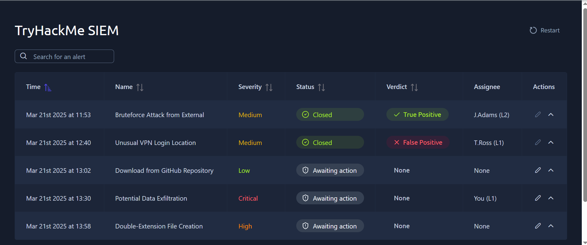
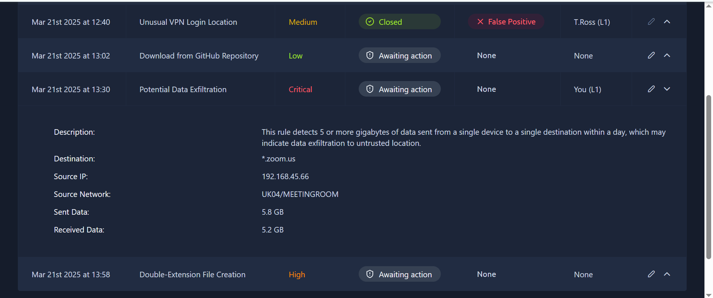
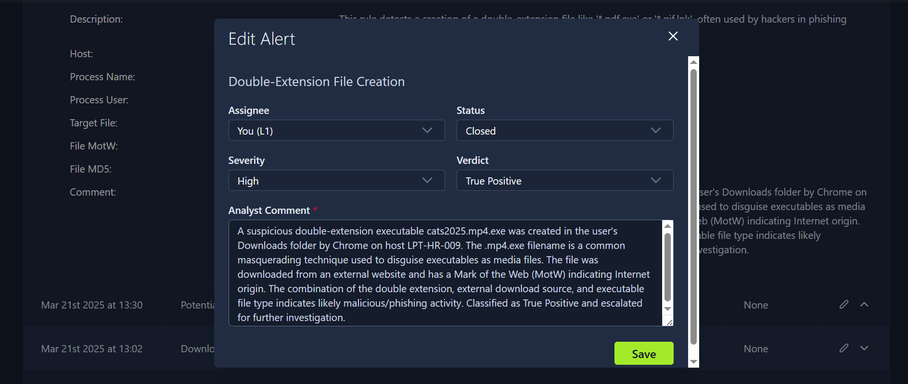
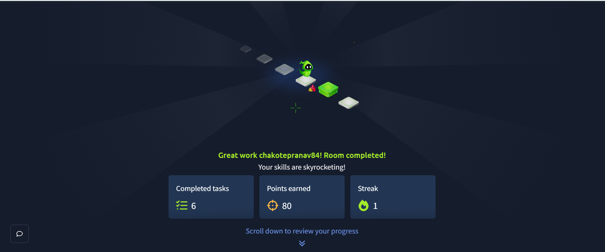

# TryHackMe – SOC L1 Alert Triage

## Overview

This repository documents my completion of the **SOC L1 Alert Triage** room on TryHackMe.

The lab simulates the workflow of a **Security Operations Center (SOC) Level 1 analyst** responsible for reviewing, prioritizing, investigating, classifying, and documenting security alerts using a simulated SIEM dashboard.

## Objectives

- Understand the SOC L1 alert lifecycle
- Review and interpret alert properties
- Prioritize alerts based on severity and status
- Take ownership of alerts
- Investigate suspicious activity using available evidence
- Distinguish True Positives from False Positives
- Document investigation findings and reasoning

---

## Alert Triage Workflow

```text
Alert Queue
     ↓
Prioritize (Severity + Status)
     ↓
Review Alert Details
     ↓
Investigate Evidence
     ↓
Determine Verdict (TP / FP)
     ↓
Document Findings
     ↓
Close / Escalate
```

### Prioritization

Alerts were prioritized by severity, with unresolved/unassigned alerts reviewed first:

```text
Critical → High → Medium → Low
```

### Alert Properties

| Property   | Purpose                                  |
|------------|-------------------------------------------|
| Alert Time | When the detection was generated          |
| Alert Name | Summary of the detected activity          |
| Severity   | Indicates urgency and potential impact    |
| Status     | Current state (Awaiting action / Closed)  |
| Verdict    | Final classification of the alert         |
| Assignee   | Analyst responsible for the alert         |

---

## Alert Queue

The dashboard presented five alerts of varying severity. Two were already resolved by other analysts (Bruteforce Attack — True Positive, Unusual VPN Login — False Positive). Three remained in **Awaiting action**, including a Critical-severity alert assigned directly to me.



---

## Investigation 1: Potential Data Exfiltration

This was the highest-severity alert in the queue (**Critical**) and was assigned to me, so I investigated it first.

### Detection Logic
Triggers when 5+ GB of data is sent from a single device to a single destination within a day.

### Alert Evidence

```text
Destination:      *.zoom.us
Source IP:         192.168.45.66
Source Network:     UK04/MEETINGROOM
Sent Data:          5.8 GB
Received Data:      5.2 GB
```



### Investigation Reasoning

Although the alert exceeded the configured data-transfer threshold, the surrounding context pointed to legitimate activity:

- The destination domain (`*.zoom.us`) belongs to a widely used, trusted video-conferencing service.
- The source network is labeled `MEETINGROOM`, indicating a conference-room device rather than a user workstation.
- Sent (5.8 GB) and received (5.2 GB) data were roughly symmetric — consistent with a live two-way video call, not a one-directional transfer typical of exfiltration.

### Verdict
**False Positive** — closed as expected video-conferencing activity.

### Key Lesson
A detection threshold alone does not prove malicious activity. Destination reputation and traffic directionality/symmetry are critical context when triaging volume-based alerts.

---

## Investigation 2: Double-Extension File Creation

This alert was rated **High** severity and flagged a file created with a double extension — a common technique for disguising executables as media or document files.

### Detection Logic
Detects the creation of double-extension files (e.g. `*.pdf.exe`, `*.gif.lnk`), often used in phishing to disguise executables as legitimate documents or media.

### Alert Evidence

```text
Host:          LPT-HR-009
Process:       Chrome
Target File:   cats2025.mp4.exe
File MotW:     Present (Internet origin)
```



### Investigation Reasoning

- The file `cats2025.mp4.exe` uses a double extension, ending in `.exe` while appearing at a glance to be a video file.
- It was created via Chrome, directly in the user's Downloads folder — consistent with a browser-based download rather than an internal process.
- The file carried a **Mark of the Web (MotW)**, confirming it originated from the internet rather than a trusted internal source.
- The combination of a disguised executable extension, external download origin, and placement in Downloads is a well-known phishing/malware-delivery pattern.

### Verdict
**True Positive** — classified as likely malicious/phishing activity and escalated for further investigation.

### Key Lesson
File-naming tricks like double extensions are a low-effort, high-impact way to bypass a user's judgment. Combined with MotW and download origin, they provide strong evidence even before any dynamic/behavioral analysis is done.

---

## Other Alerts in Queue (Not Yet Actioned)

- **Download from GitHub Repository** (Low severity) — remained in Awaiting action. Triage of this type of alert would involve checking whether GitHub is an approved resource for the user, which repository was accessed, and whether the downloaded file has suspicious characteristics — rather than assuming malicious intent from the destination alone.

---

## Room Completion



---

## SOC L1 Responsibilities (Reinforced by the Lab)

- Monitor and prioritize incoming alerts
- Perform initial investigation using available evidence
- Distinguish false positives from genuine threats
- Document findings with clear reasoning
- Escalate confirmed or suspicious activity to L2

---

## Skills Demonstrated

- SOC L1 alert triage and prioritization
- SIEM dashboard navigation and alert lifecycle management
- True Positive / False Positive classification using contextual evidence
- Network traffic pattern analysis (volume, directionality, destination reputation)
- File-based indicator analysis (double extensions, MotW, download origin)
- Analyst documentation and reasoning

---

## Key Takeaways

1. **Alerts are not automatically incidents** — a detection rule flags activity that requires investigation, not a confirmed threat.
2. **Context is critical** — the same traffic pattern can be benign or malicious depending on source, destination, and network segment.
3. **Detection thresholds can generate false positives** — high data volume alone doesn't indicate exfiltration.
4. **Multiple weak indicators together build strong evidence** — no single field proved the double-extension file malicious, but the combination did.
5. **Documentation matters** — a SOC analyst should record what was observed, what was investigated, and why the alert was classified as it was.

## Platform
**TryHackMe**

## Room
**SOC L1 Alert Triage**

## Status
**Completed**
