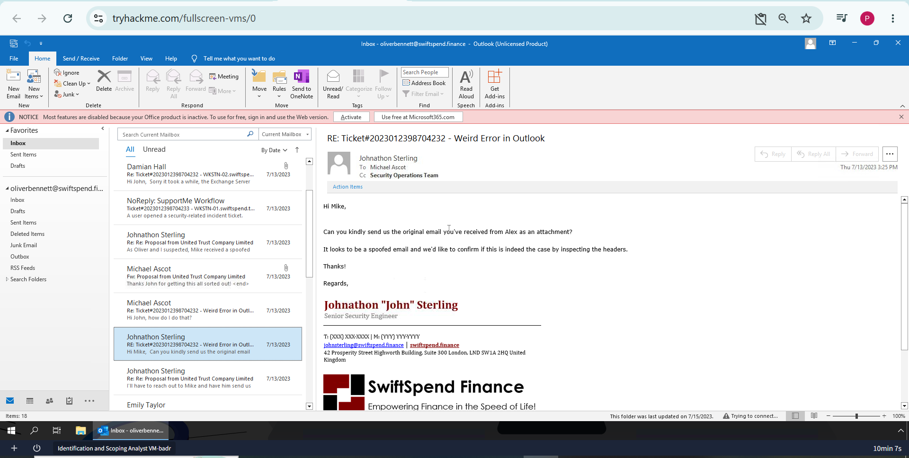
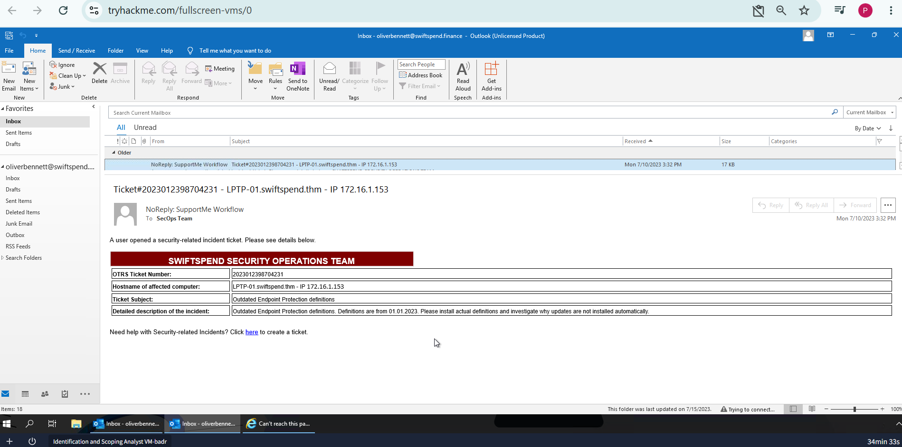
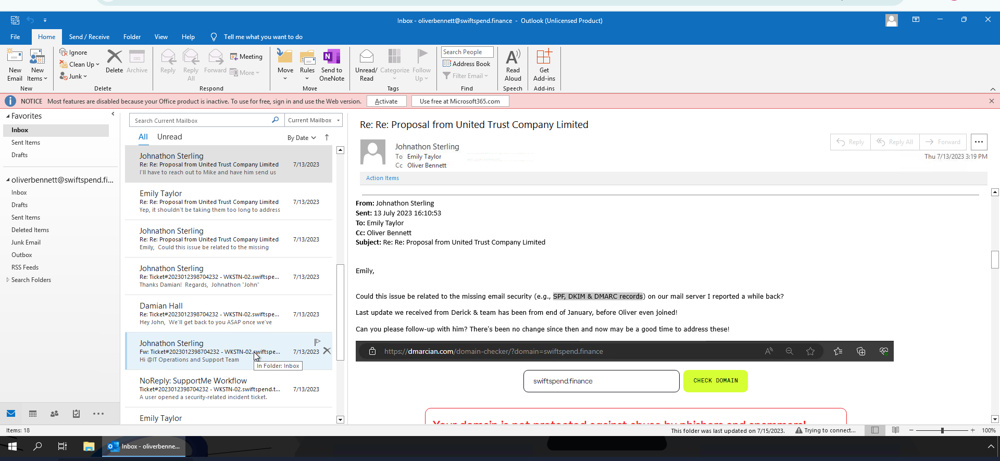
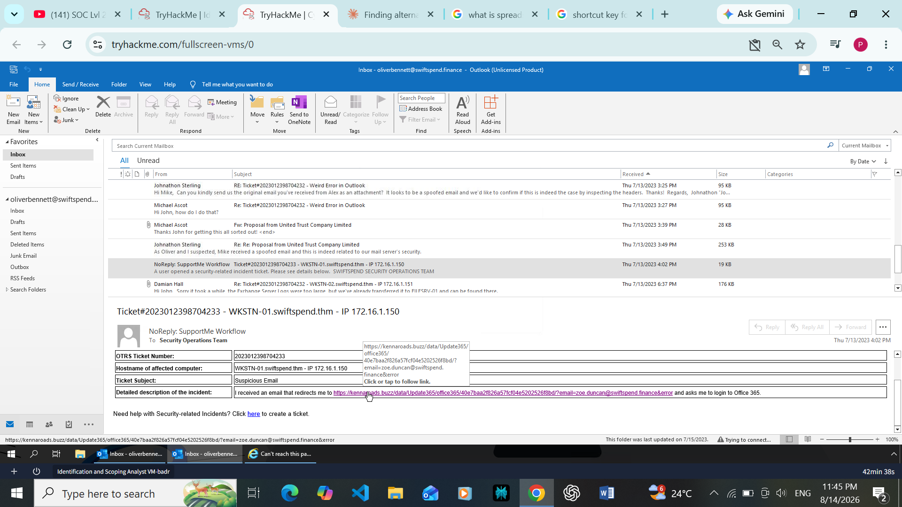
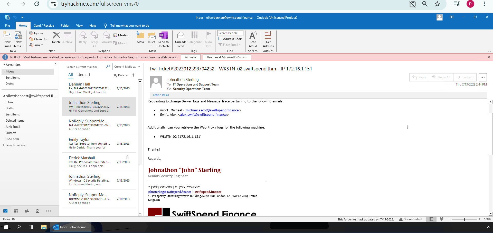
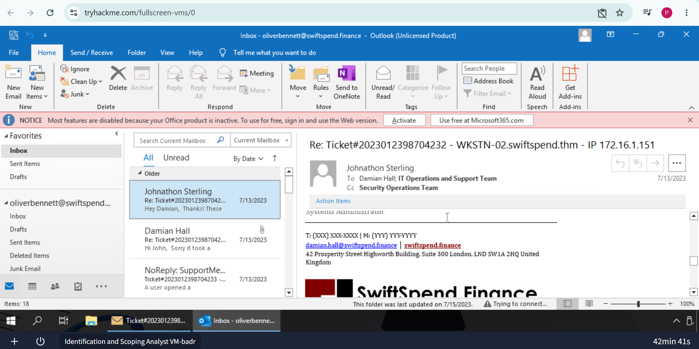
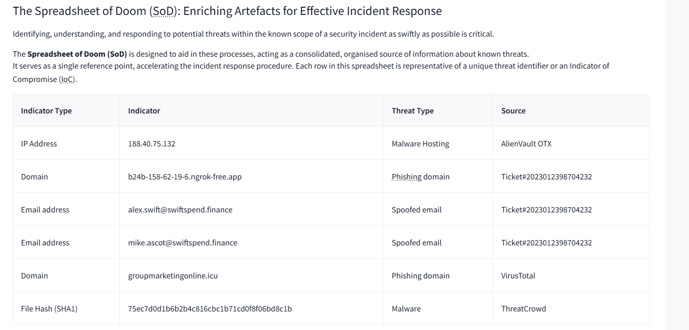
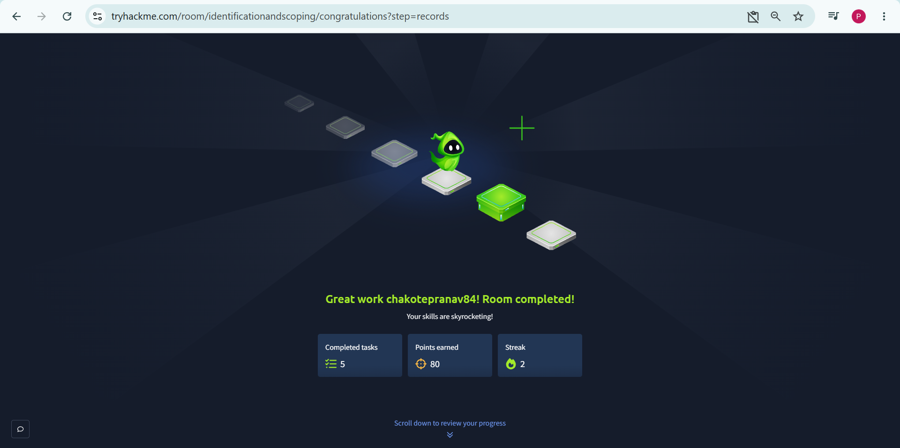

# Identification & Scoping — Incident Response Investigation

**Platform:** TryHackMe | **Room:** [Identification & Scoping](https://tryhackme.com/room/identificationandscoping) | **Module:** Incident Response | **Status:** ✅ Completed (100%)

---

## 📋 Overview

This lab simulates the **Identification & Scoping** phase of the incident response lifecycle at a fictional company, **SwiftSpend Financial (SSF)**. Stepping into the role of a SOC analyst, I investigated a series of support tickets reporting suspicious activity, cross-referenced affected systems against an Asset Inventory, traced a phishing campaign back to its source domain, and consolidated all findings into a Spreadsheet of Doom (SoD) — a working threat intelligence artifact used to scope the true extent of the compromise.

**Objective:** Determine what happened, which systems and users were affected, and how far the incident had spread — before containment begins.

---

## 🧠 Skills Demonstrated

- Ticket triage and evidence gathering from raw email/helpdesk data
- Cross-referencing affected hosts against an Asset Inventory to identify ownership
- Email header analysis and spoofing detection (SPF / DKIM / DMARC)
- Identifying and validating phishing infrastructure (malicious URLs, phishing domains)
- Escalating for additional evidence (log requests — Exchange, Web Proxy)
- Structuring findings into a centralized IOC tracker (Spreadsheet of Doom)

---

## 🔍 Investigation Walkthrough

### 1. First Ticket & Asset Inventory Cross-Reference
Ticket `#2023012398704232` reported a "Weird Error in Outlook" on host `WKSTN-02.swiftspend.thm` (IP `172.16.1.151`). Cross-referencing this hostname against the Asset Inventory identified the machine owner as **Michael Ascot**.

### 2. Spoofed Email Investigation
Senior Security Engineer Johnathon Sterling requested the original email be forwarded as an attachment so the headers could be inspected — the first indicator that this wasn't a simple user error, but a suspected spoofed message.

### 3. SPF / DKIM / DMARC Check
The team linked the incident to a previously-reported gap: missing email authentication records on the mail server. Running `swiftspend.finance` through a domain checker confirmed the domain was **not protected against abuse by phishers and spammers** — explaining how the spoofed email was able to reach an internal inbox.

### 4. Phishing Domain Identified
A related ticket (`#2023012398704233`, host `WKSTN-01`) contained a malicious link disguised as an Office 365 login redirect. Inspecting the link revealed the actual phishing domain: `kennaroads.buzz`.

### 5. Log Escalation
To fully scope the incident, I requested Exchange Server logs and Message Trace data for the two potentially-compromised accounts (`michael.ascot`, `alex.swift`), plus Web Proxy logs for `WKSTN-02` — necessary artifacts to confirm whether the phishing attempt succeeded.

### 6. Second Ticket — Independent Issue
Ticket `#2023012398704231` flagged outdated Endpoint Protection definitions on `LPTP-01.swiftspend.thm` (IP `172.16.1.153`). Cross-referencing the Asset Inventory identified the owner as **Derick Marshall** — demonstrating the same triage process applied to an unrelated ticket.

### 7. Spreadsheet of Doom — Consolidated Findings
All indicators of compromise gathered during the investigation were consolidated into the SoD, the team's centralized threat intelligence reference point.

| Indicator Type | Indicator | Threat Type | Source |
|---|---|---|---|
| IP Address | `188.40.75.132` | Malware Hosting | AlienVault OTX |
| Domain | `b24b-158-62-19-6.ngrok-free.app` | Phishing domain | Ticket #2023012398704232 |
| Email address | `alex.swift@swiftspend.finance` | Spoofed email | Ticket #2023012398704232 |
| Email address | `mike.ascot@swiftspend.finance` | Spoofed email | Ticket #2023012398704232 |
| Domain | `groupmarketingonline.icu` | Phishing domain | VirusTotal |
| File Hash (SHA1) | `75ec7d0d1b6b2b4c816cbc1b71cd0f8f06bd8c1b` | Malware | ThreatCrowd |

### 8. Room Completion
All 5 tasks completed — 80 points earned.

---

## 💡 Key Takeaway

This room reinforced how **Identification and Scoping feed each other in a continuous loop**: every new artifact (a ticket, a header, a link) either narrows or widens the known scope of an incident. Working through SwiftSpend's tickets end-to-end — rather than just answering isolated quiz questions — showed how a SOC analyst pieces together a full picture from fragmented evidence: user reports, an Asset Inventory, email metadata, and a shared IOC repository, before any containment action is taken.

---

## 🔗 Room Link

[TryHackMe — Identification & Scoping](https://tryhackme.com/room/identificationandscoping)
