# 🔍 Exploring SPL | Splunk Lab Documentation

## 📌 Overview

This repository documents my hands-on completion of the **Exploring SPL** lab on **TryHackMe**.

The lab focuses on learning and practicing the fundamentals of **Splunk Search Processing Language (SPL)** using Windows event logs. During the lab, I performed searches, filtered events, manipulated fields, analyzed log data, and created visualizations.

This documentation is part of my hands-on cybersecurity and SOC Analyst learning portfolio.

> **Note:** This is documentation of a TryHackMe lab completed for educational and hands-on learning purposes. The lab content and environment are provided by TryHackMe.

---

## 🎯 Lab Objectives

During this lab, I practiced:

- Searching indexed Windows logs
- Exploring data using Splunk Data Summary
- Filtering events using Event IDs
- Using Boolean search conditions
- Performing wildcard searches
- Selecting specific fields
- Removing duplicate results
- Renaming fields
- Sorting and reversing search results
- Using `head` and `tail`
- Performing statistical analysis
- Creating charts and visualizations

---

## 🛠️ Tools & Technologies

- **TryHackMe**
- **Splunk**
- **Search Processing Language (SPL)**
- **Windows Event Logs**

---

# 📂 Documentation Structure

```text
exploring-spl/
│
├── README.md
│
└── screenshots/
    ├── 01_initial-search-windowslogs.png
    ├── 02_data-summary-host.png
    ├── 03_operator-eventid-filter.png
    ├── 04_operator-boolean-and.png
    ├── 05_operator-wildcard-cyber.png
    ├── 06_table-reverse.png
    ├── 07_dedup-hostname.png
    ├── 08_fields-command.png
    ├── 09_rename-command.png
    ├── 10_sort-command.png
    ├── 11_head-tail-command.png
    ├── 12_stats-count-by-host.png
    ├── 13_chart-eventid-by-image.png
    └── 14_room-completed.png
```

---

# 🔎 Lab Walkthrough

## 1. Initial Search

### SPL Query

```spl
index=windowslogs
```

This query searches all available events in the `windowslogs` index.

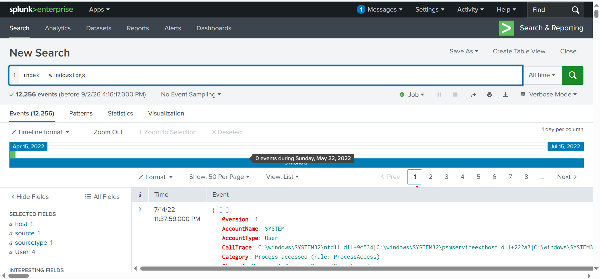

---

## 2. Exploring Available Hosts

The **Data Summary** feature was used to explore the available data and hosts.

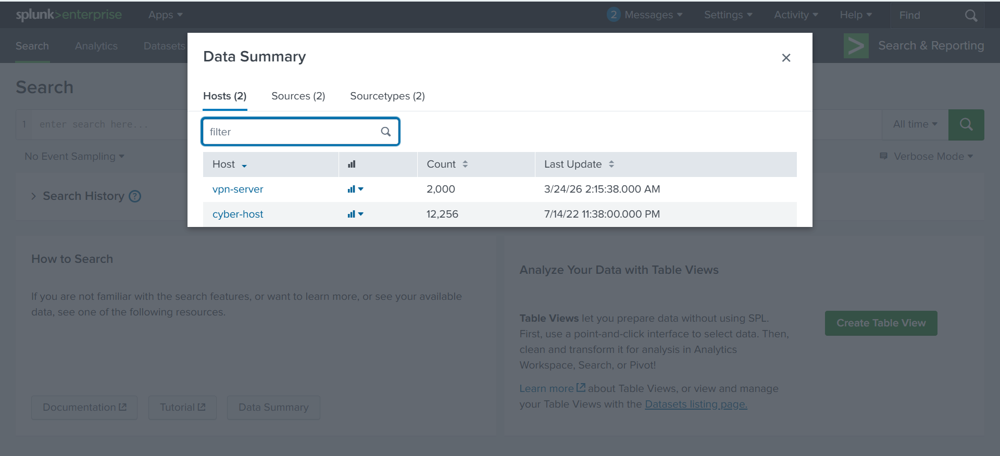

---

## 3. Filtering Events Using EventID

### SPL Query

```spl
index=windowslogs EventID=1
```

This query filters the results to display events with `EventID=1`.

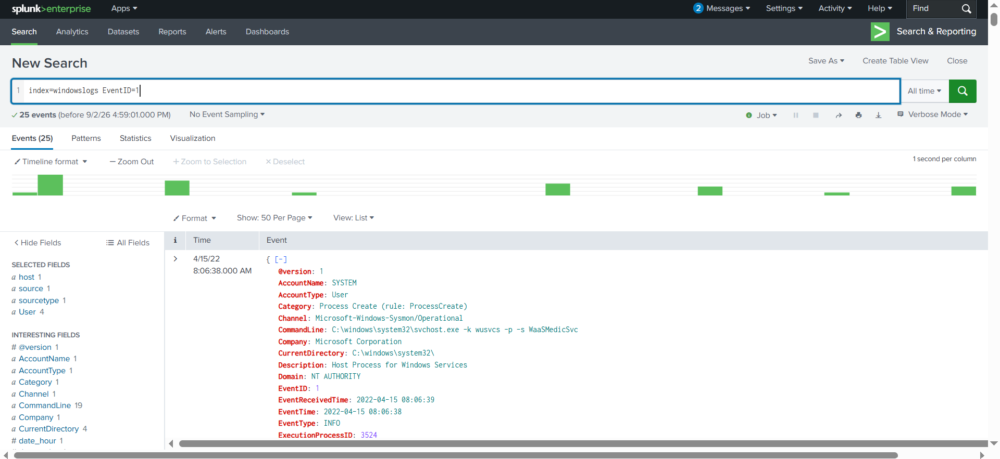

---

## 4. Boolean AND Search

### SPL Query

```spl
index=windowslogs EventID=1 User=*James*
```

This query searches for events that match both conditions.

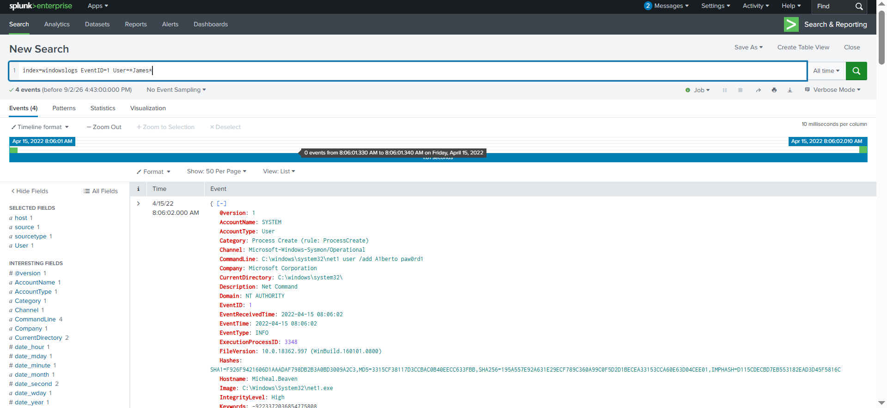

---

## 5. Wildcard Search

### SPL Query

```spl
index=windowslogs cyber*
```

The wildcard character `*` is used to search for matching terms.

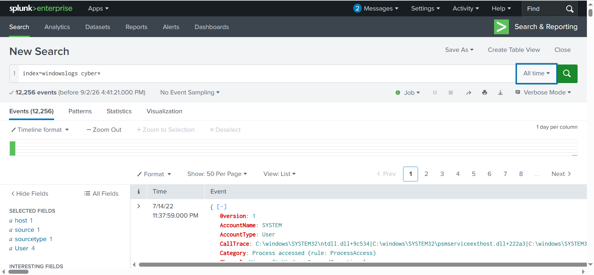

---

## 6. Table and Reverse Commands

### SPL Query

```spl
index=windowslogs
| table _time EventID Hostname SourceName
| reverse
```

The `table` command displays selected fields, while `reverse` reverses the result order.

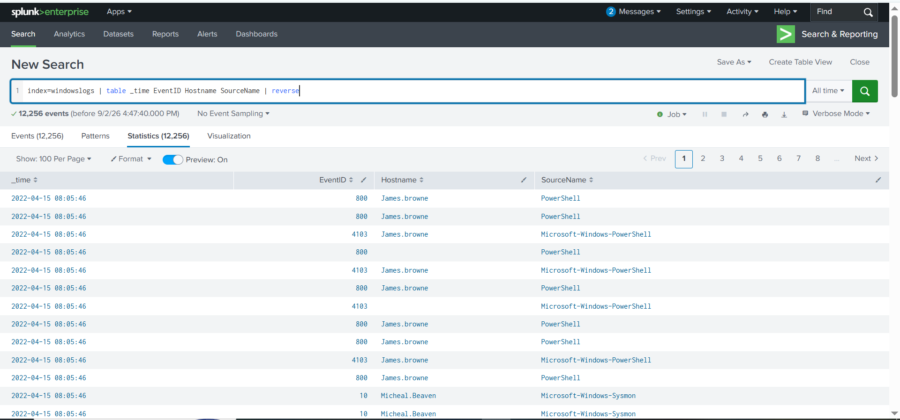

---

## 7. Removing Duplicate Hostnames

### SPL Query

```spl
index=windowslogs
| dedup Hostname
| table _time EventID Hostname SourceName
| reverse
```

The `dedup` command removes duplicate values from the specified field.

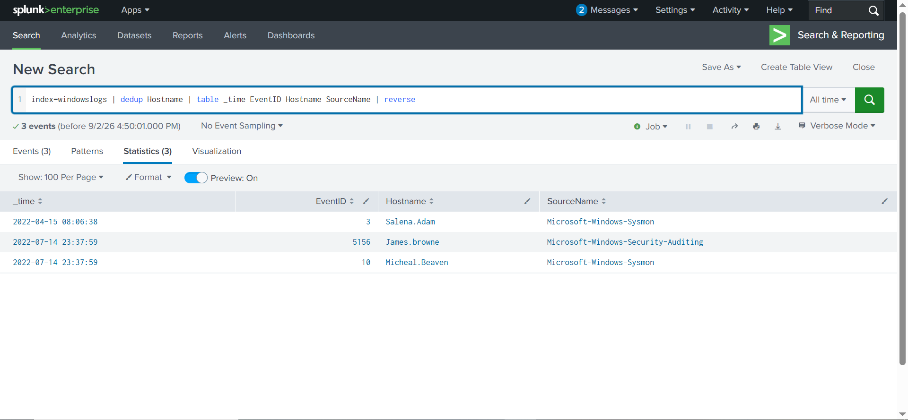

---

## 8. Fields Command

### SPL Query

```spl
index=windowslogs
| fields EventID Hostname SourceName
```

The `fields` command displays only the specified fields.

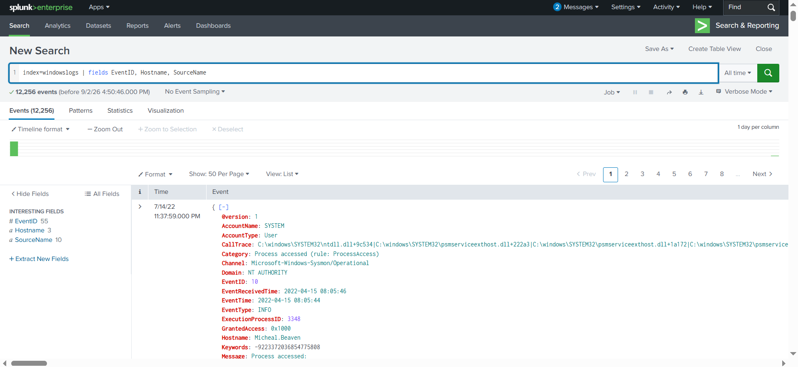

---

## 9. Rename Command

### SPL Query

```spl
index=windowslogs
| table _time EventID Hostname SourceName
| rename Hostname as Host
```

The `rename` command changes the field name from `Hostname` to `Host`.

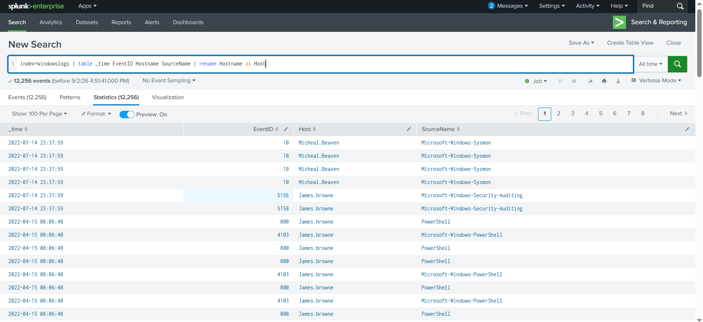

---

## 10. Sorting Results

### SPL Query

```spl
index=windowslogs
| table _time EventID Hostname SourceName
| sort -_time
```

The `sort` command organizes the search results. The `-` indicates descending order.

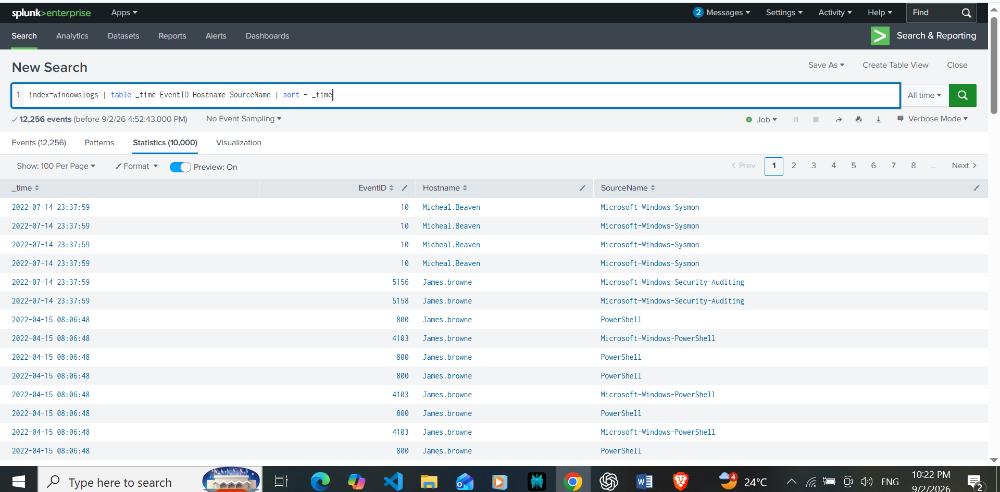

---

## 11. Head and Tail Commands

### Head

```spl
index=windowslogs
| head 10
```

The `head` command returns the first specified number of results.

### Tail

```spl
index=windowslogs
| tail 10
```

The `tail` command returns the last specified number of results.

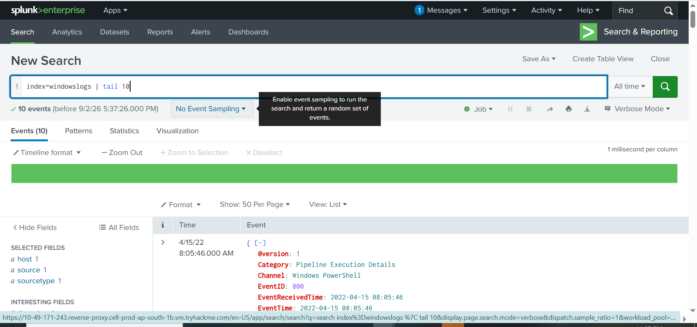

---

## 12. Statistical Analysis

### SPL Query

```spl
index=windowslogs
| stats count by host
```

The `stats` command is used to perform statistical analysis. This query counts events grouped by host.

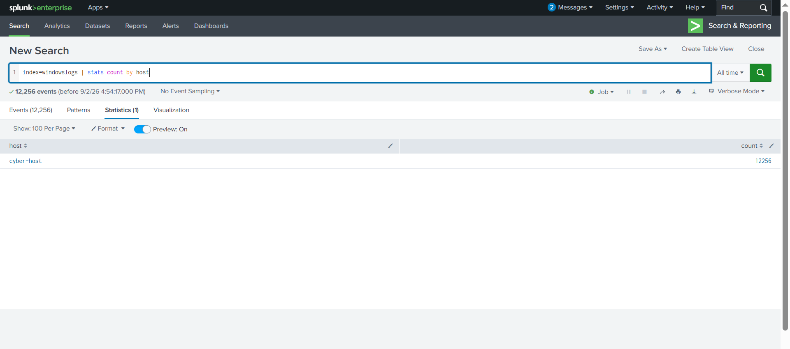

---

## 13. Creating a Chart

### SPL Query

```spl
index=windowslogs
| chart count(EventID) by Image
```

The `chart` command aggregates the data for analysis and visualization.

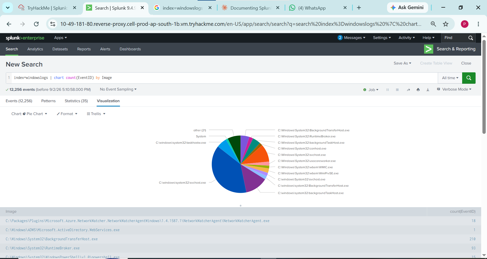

---

# 🧠 SPL Commands Practiced

| Command | Purpose |
|---|---|
| `index` | Searches a specific Splunk index |
| `table` | Displays selected fields |
| `fields` | Includes selected fields |
| `dedup` | Removes duplicate values |
| `rename` | Renames a field |
| `sort` | Sorts results |
| `reverse` | Reverses result order |
| `head` | Returns the first results |
| `tail` | Returns the last results |
| `stats` | Performs statistical analysis |
| `chart` | Aggregates data for visualization |

---

# 🔐 SOC Analyst Relevance

SPL is an important skill for SOC analysts because SIEM platforms such as Splunk are used to investigate and analyze security events.

The skills practiced in this lab are relevant to:

- Log analysis
- Event investigation
- Security monitoring
- Threat hunting
- Data filtering
- Identifying suspicious activity
- Event aggregation
- Security data visualization

---

# 🎓 Lab Completion

The TryHackMe lab was successfully completed.

**Lab Completion:**

- ✅ Tasks Completed: 8
- 🏆 Points Earned: 152

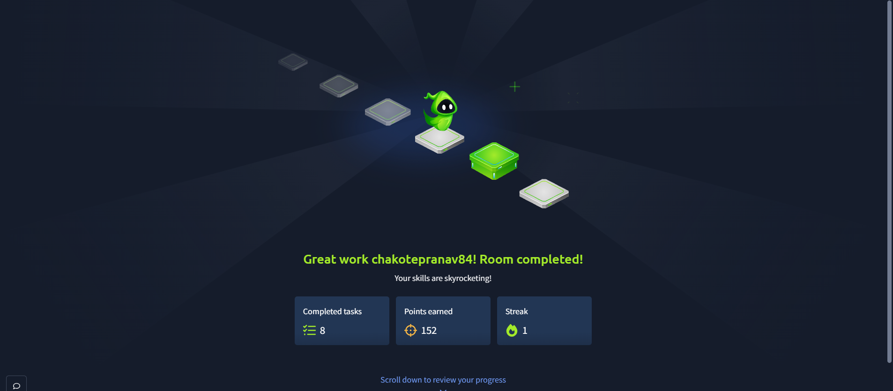

---

# 📚 Key Takeaways

After completing this lab, I gained hands-on experience with:

- Basic Splunk navigation
- SPL search syntax
- Windows event log analysis
- Filtering and querying security logs
- Field manipulation
- Data aggregation
- Statistical analysis
- Basic data visualization

This lab helped strengthen my foundational understanding of how a SOC Analyst can use Splunk to search, filter, and investigate security-related logs.

---

# 👤 Author

**Pranav Bharat Chakote**

Aspiring SOC Analyst | Cybersecurity Enthusiast

---

## ⚠️ Disclaimer

This repository is intended for **educational and portfolio documentation purposes**. The lab environment and original learning material belong to **TryHackMe**. The documentation, screenshots, and notes in this repository represent my personal hands-on learning and lab completion.
